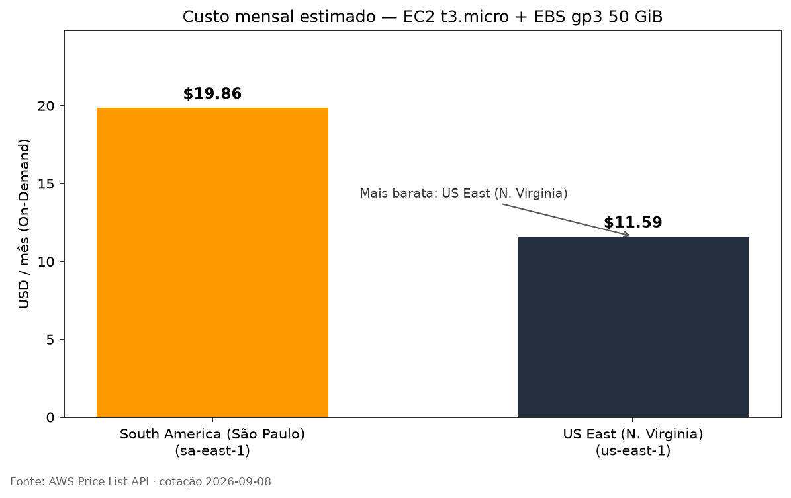
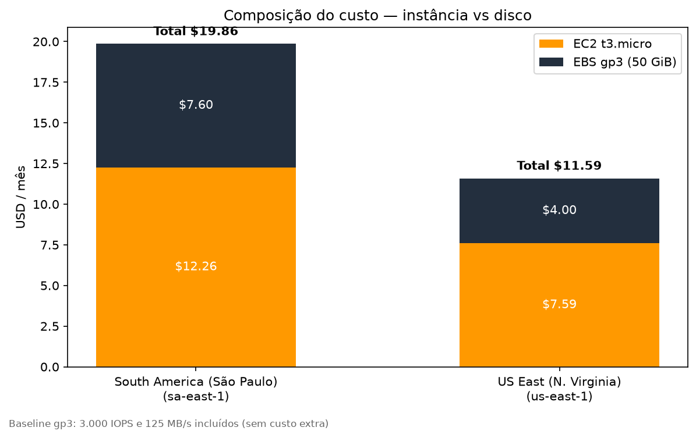
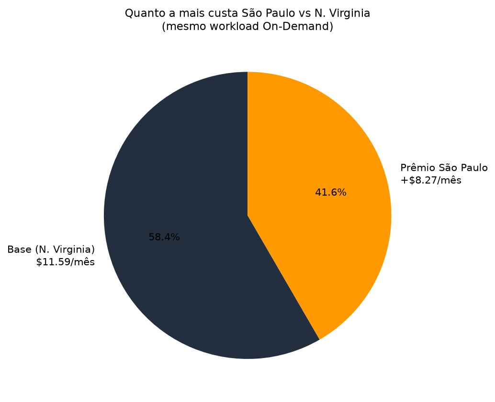

# FIAP - Faculdade de Informática e Administração Paulista

<p align="center">
<a href="https://www.fiap.com.br/"></a>
</p>

# FarmTech na Era da Cloud Computing

## Grupo — Fase 5, Capítulo 1 · turma 1TIAOA

## Integrantes

- Higor Henrique Garcia — RM 571820
- Vinicius Alves Lopes dos Anjos — RM 572814
- Humberto Salim — RM 570536
- Igor Zeviani Nogueira — RM 572822

[](https://colab.research.google.com/github/higorhg/farmtech-fase5-cap1/blob/main/src/HigorHenriqueGarcia_rm571820_pbl_fase4.ipynb)

## Descrição

Projeto **Machine Learning na cabeça** sobre o dataset oficial `crop_yield.csv` (156 registros: cultura, precipitação, umidades, temperatura e rendimento). O notebook único faz EDA, clusterização de tendências de rendimento, detecção de outliers e **cinco regressores** no mesmo protocolo. No mesmo repositório está a comparação On-Demand AWS entre **São Paulo** e **N. Virginia**.

Este README não replica o relatório do notebook: aponta o arquivo, os vídeos e o essencial para reproduzir.

## Vídeos (YouTube não listado)

- Entrega 1 — ML (≤ 5 min): `SUBSTITUIR_APOS_UPLOAD`
- Entrega 2 — calculadora AWS (≤ 5 min): `SUBSTITUIR_APOS_UPLOAD`

## Notebook oficial

[`src/HigorHenriqueGarcia_rm571820_pbl_fase4.ipynb`](src/HigorHenriqueGarcia_rm571820_pbl_fase4.ipynb)

Já contém saídas executadas (dicionário, EDA, clusters, tabela das 5 regressões). Para gravar o vídeo ou revisar no navegador, use o botão **Open in Colab** acima — é o fluxo do [vídeo de instrução do curso](https://www.youtube.com/watch?v=5ZYRqca7OVc) (Colab → GitHub). O arquivo já está neste repositório; não precisa reenviar.

## Entrega 1 — ML (resumo)

Protocolo comum: `random_state=42`, teste 25%, Isolation Forest (3%) **somente no treino**.

| Algoritmo | Parte |
|---|---|
| Linear Regression | Higor |
| Decision Tree | Humberto |
| KNN Regressor | Humberto |
| Random Forest | Vinícius |
| Gradient Boosting | Vinícius |

Melhor RMSE no conjunto de teste, nesta execução: **Linear Regression**. KNN fica atrás neste conjunto pequeno. Figuras de EDA em `assets/eda/`; comparação de RMSE em `assets/comparison/`.

## Entrega 2 — AWS

Estimativa **On-Demand 100%**, Linux, `t3.micro` (2 vCPU, 1 GiB, até 5 Gbit) + **50 GiB gp3**. Cotação 08/09/2026 (AWS Price List).

| Região | Total / mês |
|---|---:|
| N. Virginia (`us-east-1`) | **US$ 11,59** (mais barata) |
| São Paulo (`sa-east-1`) | **US$ 19,86** |

**Região escolhida: São Paulo.** Com restrição legal de dado no exterior e necessidade de acesso rápido, o custo extra é o prêmio de residência no Brasil (LGPD) e menor latência para o usuário nacional. Detalhe em [`document/aws_justificativa.md`](document/aws_justificativa.md).







## Estrutura

- `src/` — notebook oficial, código Python, `data/crop_yield.csv`, testes
- `assets/` — figuras (EDA, comparação de modelos, AWS) e logo
- `document/` — contrato dos modelos, comparação e justificativa AWS
- `scripts/` — geração de figuras e notebooks
- `README.md` — este guia

## Como executar

```bash
python3 -m venv .venv
source .venv/bin/activate
pip install -r src/requirements.txt
cd src
python -m unittest discover -s tests -q
python -c "from comparison import run_comparison, save_outputs; print(save_outputs(run_comparison())['best_model'])"
```

Abrir o notebook em `src/` (o kernel precisa enxergar essa pasta).

## Histórico

- 1.0.0 — 08/09/2026 — Entrega Cap 1 (ML + Cloud)

## Licença

Modelo Git FIAP — Attribution 4.0 International (template do curso).
